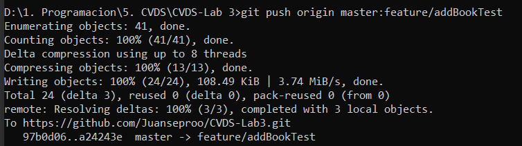

# LABORATORIO 3 - TDD
#### TALLER 3.
#### Testing - TDD

### PRE-RREQUISITOS

* Java OpenJDK Runtime Environment: 17.x.x
* Apache Maven: 3.9.x
* JUnit: 5.x.x
* Docker

### OBJETIVOS

1. Como hacer pruebas unitarias.
2. Utilizar anotaciones @Test del framework JUnit
3. Aplicar TDD.

## DESCRIPCIÓN PROYECTO

El proyecto consiste en un sistema de gestión de bibliotecas, donde hay clases que representan Libro, Usuario, Prestamo, y Biblioteca. Los usuarios pueden tomar prestados libros de la biblioteca, y la Biblioteca se encarga de gestionar los préstamos, asegurarse de que los libros estén disponibles, y mantener un registro de los libros prestados.

## CREAR PROYECTO CON MAVEN

```
Grupo: edu.eci.cvds 
Artefacto: Library 
Paquete: edu.eci.cvds.tdd 
archetypeArtifactId: maven-archetype-quickstart 
```

## AGREGAR DEPENDENCIA JUNIT 5

* Buscar en maven central la dependencia de JUnit5 en su versión más reciente.
<!-- https://mvnrepository.com/artifact/junit/junit -->
```
<dependency>
    <groupId>junit</groupId>
    <artifactId>junit</artifactId>
    <version>4.13.2</version>
    <scope>test</scope>
</dependency>
```
(https://mvnrepository.com/artifact/junit/junit/4.13.2)

* Edite el archivo pom.xml del proyecto para agregar la dependencia.


* Verifique que la versión de java sea la 17
```
  <properties>
    <maven.compiler.target>17</maven.compiler.target>
    <maven.compiler.source>17</maven.compiler.source>
  </properties>
```
Lo anterior significa que la versión de Java es 17

* Compile el proyecto para validar que todo este bien.


## AGREGAR ESQUELETO DEL PROYECTO
Cree los siguientes paquetes dentro de edu.eci.cvds.tdd

* library
    * book
    * loan
    * user


## AGREGAR CLASES


## PRUEBAS UNITARIAS Y TDD

Para poder implementar los métodos addBook, loanABook y returnLoan de la clase Library vamos a aplicar la técnica de TDD, por cada caso de prueba se debe hacer un commit, cada commit debe tener la prueba nueva y la implementación para que la prueba del commit funcione. Las pruebas anteriormente implementadas deben continuar funcionando. Como están trabajando en parejas es necesario trabajar en ramas independientes y utilizar Pull Request para mezclar los cambios.

### CREAR CLASE DE PRUEBA
Es necesario crear la clase de prueba para edu.eci.cvds.tdd.Library, la clase debe seguir los estándares de nombres estudiados en clase.

Para pensar en los casos de pruebas lean detenidamente el javadoc de los métodos para reconocer las clases de equivalencia, basados en las clases de equivalencia se debe crear una prueba la cual debe fallar y posteriormente implementar el código necesario para que funcione, este proceso se debe repetir hasta cumplir con la especificación definida en el javadoc.


### Implementación y Pruebas addBook

Se importaron las librerias necesarias


Se instanció los recursos que se necesitan para las pruebas


Y finalmente se hicieron las pruebas


Se aseguró que las pruebas fallarán


Se subió a git en la rama feature/addBookTest lo que se lleva 


Luego por medio de TDD, se hizo la clase addBook


Se comprobó que funcionaban las pruebas


Se subió a github en la rama feature/addBookTest



Luego, se creó una rama Release y se subió todo lo que tiene feature/addBookTest 


Por último se hizo merge entre release y main


### Implementación y Pruebas loanABook 

Se realizaron las pruebas pertinentes 


Se implementó el método adecuadamente para que las pruebas pasaran


### Implementación y Pruebas returnLoan

Se realizaron las pruebas pertinentes


Se implementó el método adecuadamente para que las pruebas pasaran


### COBERTURA (Jacoco)
Agregar la dependencia de jacoco, utilizar la última versión disponible en maven central.
Para usar Jacoco es necesario agregar la siguiente sección en el pom.xml

```
<build>
    <plugins>
      <plugin>
        <groupId>org.jacoco</groupId>
        <artifactId>jacoco-maven-plugin</artifactId>
        <version>0.8.12</version>
        <executions>
          <execution>
            <goals>
              <goal>prepare-agent</goal>
            </goals>
          </execution>
          <execution>
            <id>report</id>
            <phase>test</phase>
            <goals>
              <goal>report</goal>
            </goals>
            <configuration>
              <excludes>
                <exclude>/configurators/</exclude>
              </excludes>
            </configuration>
          </execution>
          <execution>
          <id>jacoco-check</id>
          <goals>
            <goal>check</goal>
          </goals>
          <configuration>
            <rules>
              <rule>
                <element>PACKAGE</element>
                  <limits>
                    <limit>
                      <counter>CLASS</counter>
                      <value>COVEREDRATIO</value>
                      <minimum>0.85</minimum><!--Porcentaje mínimo de cubrimiento para construir el proyecto-->
                    </limit>
                  </limits>
                </rule>
              </rules>
            </configuration>
          </execution>
        </executions>
      </plugin>
    </plugins>
  </build>
```


Ahora al compilar el proyecto en la carpeta target se debe crear una carpeta con el nombre site la cual tiene un index.html, al abrir dicho archivo se debe ver la cobertura total y de cada una de las clases, el objetivo es tener la cobertura superior al 80%..

Explore los links del reporte en el cual le muestra que partes del código tienen prueba y cuales no.

### SONARQUBE
Ahora es necesario hacer el análisis estático del código usando SonarQube, para lo cual necesitamos tener Docker.

* Para lo cual se debe descargar la imagen de docker con el siguiente comando docker pull sonarqube
* Ahora se debe arrancar el servicio de SonarQube con el siguiente comando docker run -d --name sonarqube -e SONAR_ES_BOOTSTRAP_CHECKS_DISABLE=true -p 9000:9000 sonarqube:latest
* Validar funcionamiento docker ps -a
* Iniciar sesión en sonar localhost:9000 cambiar la clave por defecto usuario y contraseña es admin.
* Entrar a las opciones de la cuenta.
* Account -> settings -> generate token.
* Una vez sonar este corriendo deben generar un token
* Instale sonarLint en el IDE que este manejando.
* Añada el plugin de Sonar en el archivo pom del proyecto.
